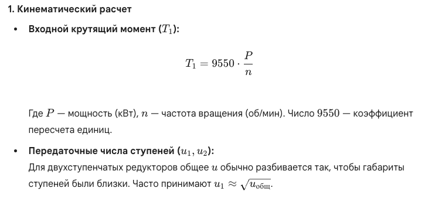
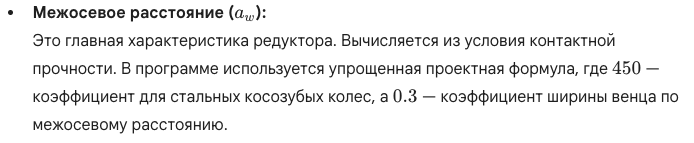
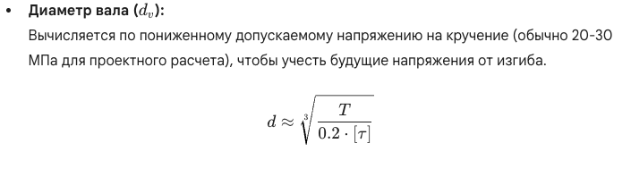
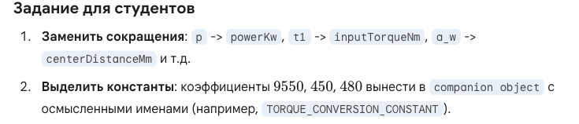

### Базовый инженерный расчет цилиндрического двухступенчатого редуктора. (в «анти-стиле»):

1. **Ужасные имена**: `a1`, `b2`, `k_v` и т.д.
2. **Магические числа**: коэффициенты взяты напрямую из ГОСТов без пояснения в коде.
3. **Линейная структура**: всё свалено в одну кучу, что затрудняет чтение.

---

## Подробное описание формул 

Чтобы студенты могли осмысленно переименовать переменные, им нужно понимать физику процесса.

### 1. Кинематический расчет

### 2. Геометрический расчет

### 3. Прочностные расчеты

### 4. Расчет валов

### 5. Подшипники

---
